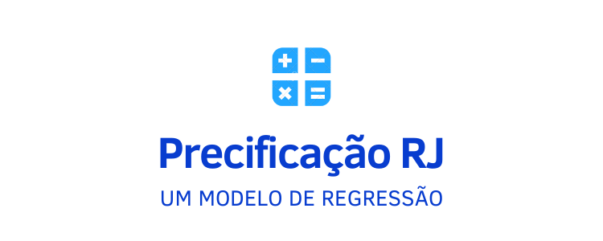
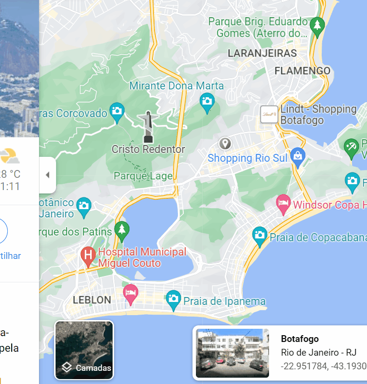

<h1 align="center"> Precifica RJ </h1>

  

## Índice 

* [Badges](#badges)
* [Índice](#índice)
* [Descrição do Projeto](#descrição-do-projeto)
* [Status do Projeto](#status-do-projeto)
* [Funcionalidades e Demonstração da Aplicação](#funcionalidades-e-demonstração-da-aplicação)
* [Acesso ao Projeto](#acesso-ao-projeto)
* [Tecnologias utilizadas](#tecnologias-utilizadas)
* [Pessoas Desenvolvedoras do Projeto](#pessoas-desenvolvedoras-do-projeto)
* [Licença](#licença)
* [Conclusão](#conclusão)

## Badges

## Descrição do Projeto

Neste projeto, serão analizados os dados referente aos anos de 2018 a 2020 das características e valores dos imóveis registrados no Airbnb da cidade do Rio de Janeiro - RJ - Brasil.  
Com base nas informações levantadas, foi treinado um modelo de IA capaz de predizer o valor esperado de um imóvel dado suas características.

Foram executadas as etapas de:
1. Compreensão do problema proposto
2. Entendimento da aplicação do problema na empresa / área
3. Extração/Obtenção dos dados
4. Ajustes / Limpeza dos dados
5. Análise exploratória das informações obtidas
6. Treinmaneto do modelo e aplicação dos algoritmos de análise
7. Interpretação dos resultados
8. Deploy do modelo para produção.

## Status do Projeto

:hotsprings: Fase de testes :hotsprings:

## Funcionalidades e Demonstração da Aplicação

O projeto apresenta duas vertentes. A primeira referente ao _Projeto de Ciência de Dados_ onde são executados todas as etapas necessárias para a produção do modelo de predição.
A segunda etapa refere-se a entrega de um _Protótipo de predição de valores de aluguéis_, baseado no modelo treinado na etapa de projeto. 

- `Projeto de Ciência de Dado`: Execução de todas as etapas, desde extração das informações até treinamento do modelo de predição
- `Protótipo de predição de valores de aluguéis`: WebApp capaz de receber novos dados e predizer valores com base no modelo treinado.

  

Para realizar a predição, são solicitadas algumas informações:

- host_listings_count: Quantidade de imóveis que o anfitrião tem disponível no AirBnB
- latitude: Valor da latitude com até 5 casas de precisão
- longitude: Valor da longitude com até 5 casas de precisão
- accomodates: Quantidade máxima de pessoas que o imóvel abriga
- bathrooms: Número de banheiros
- bedrooms: Número de quartos
- beds: Número de camas disponíveis
- extra_people: Taxa para pessoas adicionais
- Ano: Ano em que o imóvel foi disponibilizado
- numero_amenities: Quantidade de "recursos" que o imóvel tem (fogão, TV, Microondas, etc)
- instant_bookable: Se o imóvel pode ser intantâneamente reservado.

Ao preencher as informações, os valores são passados para o modelo treinado que retorna um valor contendo o valor da diária do imóvel.

## Acesso ao projeto

Todas as informações para executar o projeto estão contidas <a href="https://github.com/ronan16/precificacao_airbnb_rj">neste repositório</a>

**Atenção**: Devido ao tamanho do modelo gerado, não era viável a hospedagem do webapp em servidores gratuítos. Se tratando de um projeto para estudo, não houve necessidade de adquirir um servidor exclusivo para hospedagem. Optou-se portanto em utilizar de forma local.

### Executando o projeto localmente

- **Projeto de Ciência de Dados**:
A etapa de Ciência de Dados foi utilizada através do Jupyter Notebook, portanto, recomenda-se a mesma ferramenta para a execução desta etapa.
  - Faça o download do arquivo: Projeto_AirBnB_RJ.ipynb
  - Acesse este [link](https://www.kaggle.com/code/allanbruno/helping-regular-people-price-listings-on-airbnb/data) e baixe os datasets.
  - Salve os dados dentro da pasta "dataset".
  - Abra o arquivo Projeto_AirBnB_RJ no Jupyter (ou outra IDE de sua preferência) e acompanhe as orientações e ordem de execução do notebook.

- **Protótipo de predição de valores**:
Para esta etapa, foi usado a biblioteca Streamlit que permite gerar com facilidade um WebApp
  - Baixe os arquivos "deploy-projeto.py", "modelo.joblib" (atenção, esse arquivo é grande"
  - Abra o prompt do Anaconda ou seu prompt de comando e execute o ambiente virtual do Python na versão 3.9 com todos os requerimentos instalados (ver sessão de [Tecnologias utilizadas](#tecnologias-utilizadas))
  - Com o Streamlit instalado e o prompt na pasta que contem os arquivos baixados, execute: _Streamlit run deploy-projeto.py_
  - Com isso, um WebApp será iniciado. Preencha conforme desejar e clique no botão ao final para gerar a predição.

Caso queria alterar ou corrigir algo, o notebook do deploy encontra-se na pasta "_deploy/deploy-projeto.ipynb_"

## Tecnologias utilizadas

Para o desenvolvimento deste projeto foram utilizados os seguintes recursos: 

## Pessoas Desenvolvedoras do Projeto

**Ronan Anacleto Lopes**

:link: [Linkedin](https://www.linkedin.com/in/ronan-anacleto/)

## Licença

O Precifica RJ por ser um modelo de estudos, está sob a licença [MIT License](https://spdx.org/licenses/MIT.html)

## Conclusão

Espero que este projeto possa contribuir para o aprendizado sobre a área de Análise de Dados através de um exemplo prático de regressão. Neste projeto, buscou-se não somente chegar à solução mas sim, apresentar todos os passos necessários para alcança-la.

